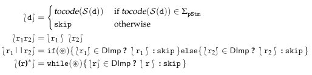

# DImp static analyzer (SAC 2020)

You can run the Dump static analyzer as

```
java -jar dimp-analyzer.jar
```

For optimization reasons, the control-flow graph generation works as follows. Given ```eval(s)```, let ```A``` the finite state automaton abstracting the strings associated with the string espression ```s``` and ```r``` the regular expression over partial statements generated from ```Regex(StmSyn(A))```. Before generating the control-flow graph over-approximating the concrete execution of ```eval(s)```, we generate an intermediate code from which we generate the control-flow graph. In particular, given ```r```, the intermediate code generation is defined inductively on the structure of the regular expression, as follows.



where the special symbol  has been introduced to model the fact that the execution may flow both to the ```true``` branch and the ```false``` branch. For example, if we consider the regular expressions of our running example:

```
x:=x+1; || while(y; || while(x>5){x:=x+1;y:=x};} || x:=x+1;(y:=10;x:=x+1;)*
```
the corresponding intermediate code is

```
if (*) {
	if (*) {
		if (*) {
			x := x + 1
		} else {
			skip
		}
	} else {
		while (x > 5) {
			x = x + 1;
			y = 10
		}
	}
} else {
	x = x + 1;
	while (*) {
		y = 10;
		x = x + 1
	}
};
```


At src/it/univr/test/eval-test you can find the eval tests proposed in the paper plus other examples.
