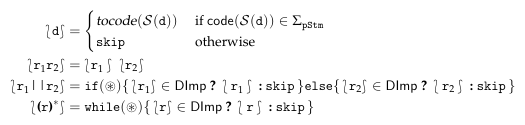

# DImp static analyzer (SAC 2020)

You can run the Dump static analyzer as

```
java -jar dimp-analyzer.jar
```

For optimization reasons, the control-flow graph generation works as follows. Given ```eval(s)```, let ```A``` the finite state automaton abstracting the strings associated with the string espression ```s``` and ```r``` the regular expression over partial statements generated from ```Regex(StmSyn(A))```. Before generating the control-flow graph over-approximating the concrete execution of ```eval(s)```, we generate an intermediate code from which we generate the control-flow graph. In particular, given ```r```, the intermediate code generation is defined inductively on the structure of the regular expression, as follows.



At src/it/univr/test/eval-test you can find the eval tests proposed in the paper plus other examples.
